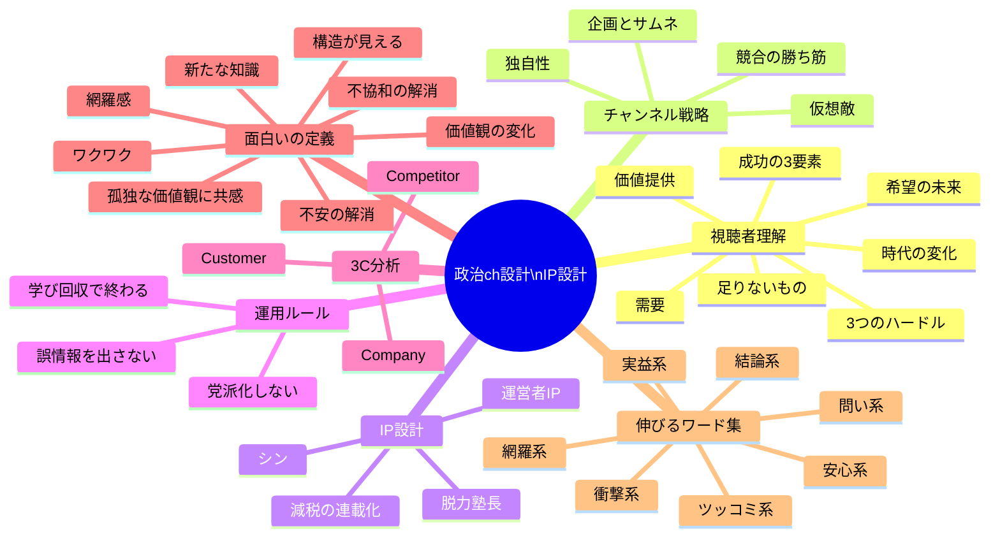
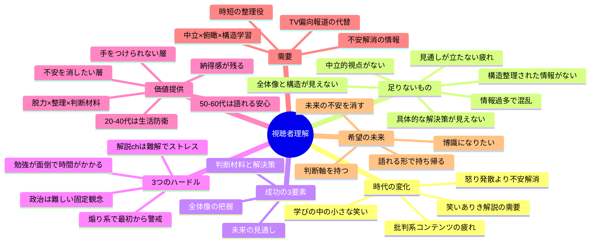
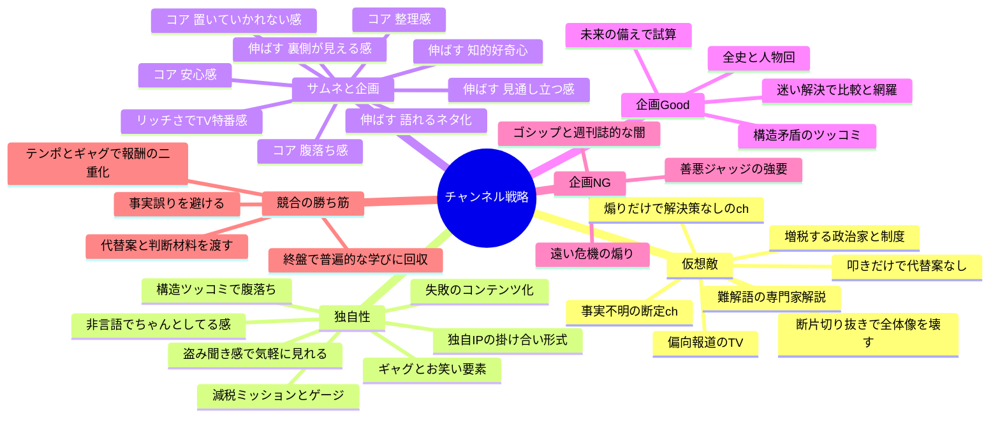
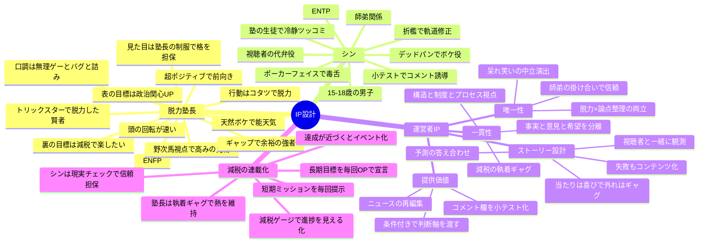
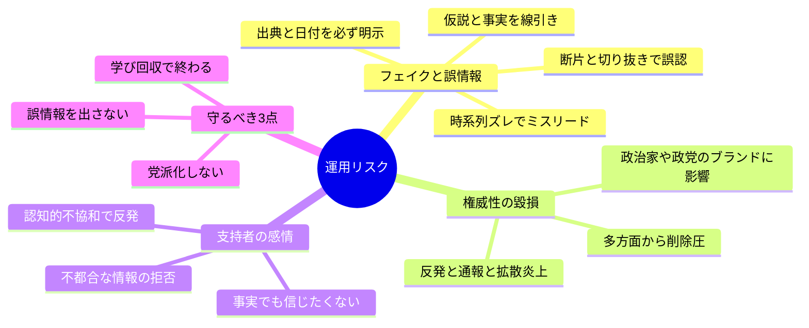
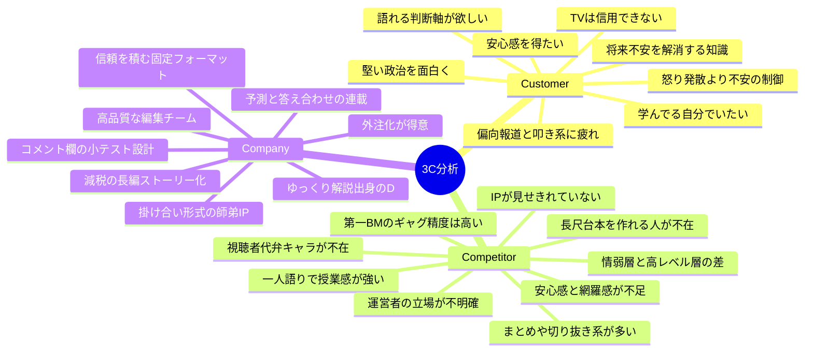
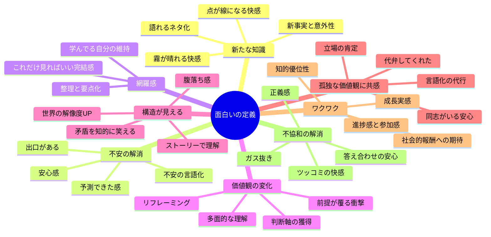
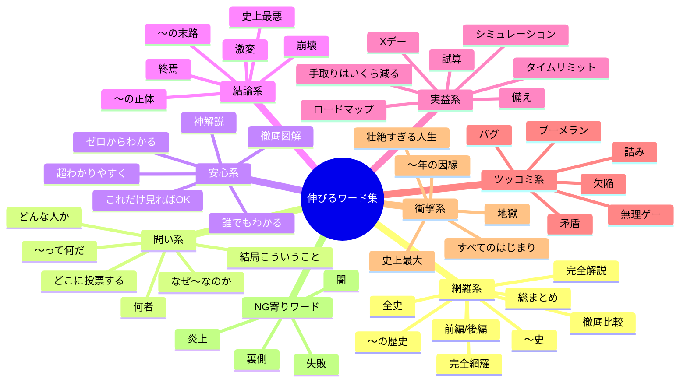

# 政治チャンネル設計 & IP設計｜マインドマップ

参照元：`IP・キャラ設定.md` / `政治視聴者.md` / `運用ガイドライン.md` / `企画・サムネ設計_〇〇感メモ.md` / `政治系チャンネル分析_伸びる企画と伸びない企画の構造.md`

---

## 1. 全体マップ

---

## 2. 視聴者理解マップ

---

## 3. チャンネル戦略マップ

---

## 4. IP設計マップ

---

## 5. 運用リスクマップ

---

## 6. 3C分析マップ

---

## 7. 視聴者の「面白い」の定義マップ

---

## 8. 伸びるワード集マップ

---

## 詳細（原文ママ）

---

### 1. 時代の変化
出典：`政治視聴者.md`

- 元々、政治系のコンテンツは罵倒、炎上、批判、政治家の裏側など、感情の起伏が強く、疲労感が残るようなコンテンツばかりだった。
- 視聴者が批判系のコンテンツに疲れているため、ギャグ、お笑いなどのリッチコンテンツで攻めていく。
- インフレ・増税など政治の不安要素が多い時代だからこそ、笑ありきで解説するchがウケる。
- **追加（視聴者心理）**
  - 不確実性が上がり、一次ニーズが「怒りの発散」＜「未来の不安の解消（判断軸/見通し）」に寄っている
  - 「善悪ジャッジ疲れ（裁判官をやらされる疲れ）」が増え、判断より"整理→未来への判断材料"が求められやすい
  - 視聴者は「娯楽を見てる自分」より「学んでる自分」でいたいので、笑いは"大騒ぎ"ではなく**学びの枠内の小さな笑い**が刺さりやすい

---

### 2. ターゲット（視聴者）は何が足りないから成功できなかったのか？
出典：`政治視聴者.md`

- わかりやすく構造を整理された情報
- 他のchで不安だけ煽られるため具体的な解決策が見えない
- 断片的な情報しか解説しないchが多いため全体像や構造が見えない
- TVなどで政治の専門家の難解な解説、偏向報道するTVの情報で中立的視点からの情報が得られない
- **追加（視聴者心理）**
  - 「何を信じればいいか」が分からず、一次情報/時系列/根拠を自分で当たるコストが高すぎる（＝情報過多で混乱）
  - "見てどう行動/観測すればいいか"に変換できず、無力感が残る（＝見通しが立たない疲れ）

---

### 3. ターゲット（視聴者）が成功するために必要な3つの要素
出典：`政治視聴者.md`

- 1：**全体像の把握（時系列・因果・利害の整理）**
  - 断片ニュースを「線」に繋げて構造を理解する
- 2：**今後（未来）の見通し**
  - 未来を当てるのではなく「次に何を知れば振り回されないか」を持つ
- 3：**具体的な解決策（判断材料/選択肢/条件付き結論）**
  - 不安を"論点"に変え、意思決定の材料に落とす（スッキリ/安心）

---

### 4. ターゲット（視聴者）が成功するための3つのハードル
出典：`政治視聴者.md`

- 1：**政治＝難しいという固定観念**
- 2：**政治解説ch＝難解でストレスになる（置いていかれない保証が弱い）**
- 3：**勉強が面倒（理解までのコストが高い/時間がかかる）**
- **追加（視聴者心理）**
  - 煽り/断罪コンテンツは"見た後に疲れる"体験があるため、最初から警戒して離脱しやすい

---

### 5. 誰にどんな価値を提供するのか？
出典：`政治視聴者.md`

- （誰に）
  - 現代の政治の構造を把握して未来の不安を取り去りたい層
  - 政治を勉強した方が良いのはわかっているけど、なかなか手をつけられない層
  - （補足）50〜60代：不安の制御＋会話で置いていかれない（語れる）／20〜40代：生活防衛（手取り/物価）を最短で理解したい
- （価値）
  - わかりやすく、見続けやすい政治ch（脱力×整理×判断材料）を提供する
  - 見終わった後に「結局こういうことか」という納得感が残る（整理感/腹落ち/安心）

---

### 6. ターゲット（視聴者）の需要はどこにあるのか？
出典：`政治視聴者.md`

- 現代の政治は派閥がわかりにくい、また難解な印象があるかつ叩き系、炎上系などの発信者が多いため、中立な立場から俯瞰的に構造を勉強したい層がいる。
- **追加（視聴者心理）**
  - 「一次情報/日付/時系列」を押さえた上で、短時間で全体像を掴ませてくれる"時短の整理役"への需要
  - 「不安を増やす」より「不安を解消できる」情報（観測ポイント/チェックリスト）の需要
  - スポンサーからの裏金などがあるため偏向報道せざるを得ないTVの情報

---

### 7. ターゲット（視聴者）の希望の未来
出典：`政治視聴者.md`

- 政治の構造を把握して、未来の不安を消したい（20〜40代）
- 政治の構造を把握して、他の人（家族、友人、井戸端会議など）に知識を自慢したい、博識になりたい
- **追加（視聴者心理）**
  - 「自分の頭で考えている感覚（判断軸）」を持ち、振り回されない
  - "語れる形（3点要約/比較）"で知識を持ち帰り、社会的報酬（尊敬/会話優位）を得たい

---

### 8. 仮想敵を設定したい

#### IP・キャラ設定.md より
- 増税する政治家
- 増税や社会保障料を引き上げるような制度
- 信頼性のない他のYouTubechなど動画発信者
- 不安だけ煽り再生数を稼ぐようなch
- TVやネットで難解な言葉で政治を解説する専門家
- 事実不明の情報を解説するch
- 政治家の制度だけを叩き解決策を与えないTVや他のch

#### 政治視聴者.md より（人物ではなく"構造"寄りにすると運用が安全）
- スポンサーからの裏金などがあるため偏向報道せざるを得ないTVの情報
- **追加（仮想敵の具体）**
  - 不安だけ煽って再生数を稼ぐch（解決策/判断材料がない）
  - 事実不明・出典不明・時系列不明の断定ch（誤情報の温床）
  - 難解語で煙に巻く専門家解説（理解コストを上げる）
  - 制度だけを叩いて"どうするか"を渡さない発信（無力感だけ残る）
  - 断片切り抜きで全体像を壊す情報環境（点が線にならない）

---

### 9. 当チャンネル（サービス）の新鮮さ・独自性

#### IP・キャラ設定.md より（なぜ自分のチャンネルか？）
- ギャグ、お笑い要素
- 特徴的でクセがある独自のIP
- 政治という重いテーマを気軽に見やすくするための工夫（ギャグや独自の編集、人格攻撃を避ける）
- 掛け合い形式のため、授業されてる感（ちゃんと見なければいけない感）＜ 他の人の会話を盗み聞きする感でより気軽に見ることができる
- 失敗もコンテンツ化・ギャグ化していく
- 減税を"長期目標"でなく、減税ミッション/減税ゲージとして分かりやすく見届けることができる

#### 政治視聴者.md より
- 独自のIPでの掛け合い形式による新鮮さ
- IPが作り込まれているため、見続ける理由を強調して作り込んでいる
- **追加（視聴者心理に刺さる独自性）**
  - 授業されてる感（ちゃんと見なければいけない感）＜ 他の人の会話を盗み聞きする感で、気軽に見られる
  - 失敗もコンテンツ化・ギャグ化する（外れを隠さず訂正できる＝信頼が積み上がる）
  - 減税を"長期目標"でなく、**減税ミッション/減税ゲージ**として進捗が見え、最後まで見届けたくなる
  - 叩き/断罪ではなく「構造に対するツッコミ」に統一して、疲れさせずに腹落ちさせる
  - 一次情報・日付・時系列を固定表示するなど、非言語で"ちゃんとしてる感"を担保する

---

### 10. IP設計
出典：`IP・キャラ設定.md`

#### 脱力塾長（メインキャラ）
- **スタンス**：最強のトリックスター（脱力した賢者）
- **MBTI**：ENFP
- **「価値観の押し付け（上から目線）」ではなく「野次馬視点（高みの見物）」**
  - 政治家を「バカにする/見下す」要素は残すが、ブチギレて怒るのではなく **「呆れて笑う」「ギャグに持っていく」**。
  - 政治全体をネタの候補にする「コメディアン/芸能人」的な立場をとる。
- **見た目と行動のギャップ**
  - 外見：一見それっぽい「塾長の制服」で、舐められない"格"を担保する
  - 行動：コタツに入る、ソファでくつろぐ、寝転びながら喋るなど、**徹底的にリラックスした姿勢**で解説する
  - 効果：「こんなにダラダラしているのに、言っていることは鋭い」というギャップが、「余裕のある強者」として映り、カリスマ性を高める
- **口調の雑さ（キャラ語彙）**：無理ゲー / バグ / 詰み
- かなりの天然ボケ＆能天気
- 超ポジティブで常に前向き
- 空気が読めない（良くも悪くも）
- 天才・カリスマ感を出すために、マイペースで自分勝手
- 細かいことは気にしない大雑把な性格
- 頭の回転が速い（バカっぽく見えるが実は優秀）
- 本人に悪気はない
- **表の目標（大義名分）**：「若者の政治関心を高め、日本の未来を明るくする（学びの提供）」
- **裏の目標（「脱力らしく」）**：「減税という夢を叶えて楽に生きるために、政治をいじくり倒す」

#### シン（掛け合い相手）
- **設定**：塾の生徒「冷静ツッコミ（毒舌）」
- **名前の由来**：芯を食うツッコミ／論点の"芯"
- **目的**：視聴者の疑問・違和感を代弁の役目
- **世界観**：場所は塾（塾長室）。距離感は"授業"ではなく、生徒が勝手にツッコんでくる感じ
- **関係性**：塾長とシンは師弟関係（塾長＝師匠／シン＝弟子）
- **生徒の役割**
  - 分からない所を代わりに聞く：視聴者が言いにくい初歩質問を投げる（代弁）
  - 冷静ツッコミ（毒舌）：塾長の脱力ボケ／政治の矛盾に、クールに刺すツッコミ
  - 折檻（※ネタ）：塾長が脱線・放浪しかけたら「減点/居残り/説教」で締め直す
  - コメント誘導：最後に「A/Bどっち？」を"小テスト"として投げる（コメント欄へ持ち帰り）
- **キャラプロフィール**
  - 年齢：15〜18歳（男子）
  - MBTI：ENTP
  - 常にポーカーフェイス（冷静沈着・クール）
  - クールで真面目（筋と論理を重視）
  - かなりの毒舌家（ただし感情ではなく"矛盾"を刺す）
  - たまにボケ役になる（顔は真顔のまま、変なことを言う＝デッドパン）

#### 運営者IP（「このチャンネルでなければいけない理由」）
狙い：視聴者が「情報」ではなく **"人（IP・運営者）" を追う理由**（＝次の投稿が気になる／成功も失敗も含めて見届けたい）

- **1) 唯一性**
  - 脱力×論点整理の両立：政治を"重い授業"にせず、脱力しながらも論点だけを切り出して整理できる
  - 中立演出：誰かの肩を持つのではなく、政治批判を呆れた笑いに変換しつつ、最後は視聴者に学びを届ける（感情→理解の二段報酬）
  - 師弟の掛け合いで担保する信頼：塾長が脱線しても、弟子のシンが「根拠」「いつの話」「結論」を冷静に折檻して軌道修正する（＝置いていかれない感の強調＝安心感）

- **2) 提供価値**
  - ニュースの"再編集"：出来事を煽りで終わらせず、時系列・因果・利害で再編集して「結局こういうこと」を作る
  - 判断軸を"条件付き"で渡す：断定の押し付けではなく、AならB（条件）で提示し、視聴者が自分の頭で判断できる形にする
  - コメント欄を"議論"ではなく"小テストの回答の場"にする：最後に「A/Bどっち？」を投げ、次回冒頭で拾って視聴者の参加価値を回収する

- **3) 一貫性（ブレない軸＝ファン化の芯）**
  - 政党・人物ではなく"構造/制度/プロセス"を見る：人格攻撃を避け、意思決定の仕組み・税制・制度の矛盾などシステム構造視点で語る
  - 事実と意見と希望を分ける：一次情報/根拠 → 解釈（論点）→ 条件付き結論（判断材料）の順で、毎回同じ型で話す
  - 執着ギャグの軸（例：減税）：推し活ではなく「実益（手取り）」を軸にし、どの党でも"実現条件"で評価する（＝立場がブレない）

- **4) ストーリー/未来を追いたくなる設計**
  - 失敗もコンテンツ化（信用を積む）：間違いがあれば「訂正/補足」を出し、学習して前進する姿を見せる（成長物語）
  - 視聴者と一緒に"観測"する：「次はここを見る（チェックポイント）」を提示し、次回で答え合わせすることで連載感を作る
  - 運営者の「予測」を毎回必ず組み込む（当たり/外れを報酬化）
    - 形式：予測（条件付き）→期限（いつまで）→観測ポイント→次回/次々回で答え合わせ
    - 当たった時：塾長が素直に喜ぶ（快感）＋シンが「珍しく正解」と淡々と褒める（ギャップで笑い）
    - 外れた時：塾長が開き直ってギャグ化（例：土下座ではなく"脱力"で誤魔化す）＋シンが真顔で減点（デッドパン）
    - 注意：外れは"隠さない"。外れを見せて訂正できる＝信頼として積み上げる

#### 減税（最終目標）を「最後まで見届けたい」に変えるキャラ設定
狙い：減税を"スローガン"で終わらせず、**進捗が追える長編ストーリー**にする（次回視聴の理由を作る）。

- 長期目標の宣言を固定：「最終目標：減税（手取りを増やす）。達成されるまで動画投稿を赤字でも過酷さにのたれ死ぬまでやめない」（毎回OPで一言）
- 短期ミッション化：毎回「今月の減税において確認すべきミッション・見ておくべきポイントや政策を1〜3個」を提示
- 進捗の見える化（お約束）：動画内に「減税ゲージ/進捗メーター」を出す。上がる条件や予想/下がる条件や予想を明示する
- 師弟の役割分担：
  - 塾長：希望（減税）を"執着ギャグ"として言い続け、熱を絶やさない（連載の旗）
  - シン：毎回「条件は満たした？」「いつまでに？」で折檻し、現実チェック（信頼）を担保
    - 期限：いつまでに何が起きる想定？（会期/選挙/予算/成立時期など）
    - プロセス：実現までの手順はどこまで進んだ？（提出→審議→採決→成立 など"今どこ？"）
    - 数の根拠：可決に必要な人数/合意は足りてる？（与野党/連立/党内の賛否）
    - 一貫性：過去の発言・投票行動と矛盾してない？（ブレ/手のひら返しの検知）
    - 制度の制約：法制度・憲法・省庁手続き・自治体など、構造的な制約に引っかからない？
    - 一次情報：根拠は何？（公式資料/会見/法案/議事録など"ソース提示"を促す）
- 達成/未達を"イベント化"：達成が近づくほど「Xデー」「最終局面」など章立てを作り、視聴者の期待を積み上げる

---

### 11. 運用リスク（前提）
出典：`運用ガイドライン.md`

政治系は、単に著作権だけではなく **誤情報判定・削除圧・分断・支持者心理**が複雑に絡む。

#### 起きやすいリスク（構造）
- **政治ニュース自体が"フェイク/誤情報"と疑われやすい**
  - 断片・切り抜き・伝聞・時系列ズレがあるだけで「ミスリード」に見えやすい
- **不都合情報は"権威性/ブランド"の毀損として扱われやすい**
  - 発信内容が政治家/政党のブランド価値に影響し得るため、反発・通報・拡散炎上のリスクが上がる
  - 場合によっては、多方面からの働きかけで削除方向に動く可能性もある
- **支持者の感情（認知的不協和）で反発が起きやすい**
  - (a) 事実でも信じたくない（自己同一性の防衛）
  - (b) 事実ではないと否定したくなる（不都合な情報の拒否）

#### 守るべき最重要3点（毎回チェック）
1. **誤情報を出さない**：出典/日付/時系列/仮説線引き（誤認・削除圧の回避）
2. **党派化しない**：人物叩きでなく構造主語、条件付き是々非々（分断と通報の回避）
3. **学び回収で終わる**：整理→判断材料→観測ポイント（疲れさせず習慣化）

---

### 12. サムネ/企画設計（〇〇感フレーム）
出典：`企画・サムネ設計_〇〇感メモ.md`

#### 視聴者が求める〇〇感

**コア（外すと弱い）**
- 安心感
- 腹落ち感 / 納得感
- 整理感 / 要点わかる感
- 置いていかれない感

**伸ばす（刺さると強い）**
- 知的好奇心（ワクワク感）
- 裏側がわかる感 / 構造が見える感
- 見通し立つ感 / 振り回されない感
- 語れるネタ化できる感（社会的報酬）
- 代弁してくれた感（スカッと感）
- 危機回避できる感

#### リッチさが必要な理由
- 政治の「堅い/面倒」をTV特番化してクリックさせるための演出
- テレビ世代（50〜60代）にとって「ニュース特番」の象徴＝信頼
- 「手間がかかっているサムネ＝高品質」が安心感に繋がる
- 教科書的デザインは「勉強しなきゃ」で疲れる。リッチデザインは「ソファでテレビ」で疲れない

#### 企画の方向性

**Good（伸びる型）**
- 迷い解決（比較・網羅）：「どこに投票？」「総まとめ」「徹底比較」
- 全史/人物回（時系列で腹落ち）：「〜の歴史」「人物完全解説」
- 未来の備え（予言ではなく試算/シミュレーション）：AならB（条件）
- ツッコミ（人格攻撃ではなく構造矛盾）：計算が合わない／手続きがバグってる

**NG（伸びない型）**
- 「遠い危機」の煽り（解決策なし）
- 「ゴシップ・週刊誌的」な闇（知的要素なし）
- 善悪ジャッジを強要する企画（視聴者が疲れる）

---

### 13. 競合分析の勝ち筋
出典：`運用ガイドライン.md`、`政治系チャンネル分析_伸びる企画と伸びない企画の構造.md`

#### 競合の強みは伸ばす
- テンポ/ギャグで気分が上がる＋政治がスッキリ分かる（視聴報酬の二重化）

#### 競合の弱みは潰す
- 事実誤り・制度説明ミスを避ける
- 代替案・判断材料（条件）を渡す
- 終盤で普遍的な学びに回収する

#### なぜ政治×エンタメの相性が良いか
- 政治は現在進行形だからこそ、ギャグ要素との相性が良い
- 深刻なトーン一辺倒だと視聴者は"解決不能な現実"に直面してしまう
- 派手な編集が与える効果：スカッと感、緊急感、退屈しない感（離脱防止）

#### 伸びるコンテンツの本質
- 「安心感」のある企画設計
- フロント＝知的好奇心、中身でエンタメの構造
- リッチなサムネで「番組感」「網羅感」「没入感」を訴求する
- 派手な編集と台本のギャグ性で政治の重さを緩和する
- 伸びない企画は全て「実益の欠如」と「不安要素（安心感の欠如）」に集約される

---

### 14. 3C分析

---

#### Customer（市場・視聴者｜視聴者のニーズ・悩み）

- 政治解説は偏向報道や叩き系の動画が多く、政治家のネガティブな面ばかりのチャンネルで不安を煽られているため疲れている。
- 政治の知識をつけて、将来の不安を解消するような、知識をつけたい。
- 安心感を得たい。
- 政治という堅苦しい内容を面白く、わかりやすく解説された動画を見たい
- だけど、TVでは政治献金やスポンサーなどもあるため、偏向報道しかされないためTVは信用できない

**補足（既存分析より）**
- コア視聴者：50代前後〜（男性比率高め、30〜40代/女性も一定数）。共通項：メディア不信／深掘り学習欲求／危機感／知的優位性
- 不確実性が上がり、一次ニーズが「怒りの発散」＜「未来の不安の解消（判断軸/見通し）」に寄っている
- 「善悪ジャッジ疲れ（裁判官をやらされる疲れ）」が増え、判断より"整理→未来への判断材料"が求められやすい
- 視聴者は「娯楽を見てる自分」より「学んでる自分」でいたいので、笑いは"大騒ぎ"ではなく**学びの枠内の小さな笑い**が刺さりやすい
- 視聴者が求める〇〇感のコア：**安心感 / 腹落ち感 / 整理感 / 置いていかれない感**
- 「一次情報/日付/時系列」を押さえた上で、短時間で全体像を掴ませてくれる"時短の整理役"への需要が強い
- 「自分の頭で考えている感覚（判断軸）」を持ち、振り回されない状態を望んでいる
- "語れる形（3点要約/比較）"で知識を持ち帰り、社会的報酬（尊敬/会話優位）を得たい
- 参照：`政治視聴者.md` / `企画・サムネ設計_〇〇感メモ.md`

---

#### Competitor（競合｜競合の量と質・共通点と弱点・差別化ポイント）

- 政治系のYouTube運営者は情弱層と、レベルが高い方の差が激しい印象。
  - →なぜなら、政治で一般的なチャンネル設計法として、まとめ集/反応集や、切り抜き系で稼いでいる人が多いから。
- また、ショートや8分尺などの長尺の中の短尺動画を上げる層が多く、30〜40分の長尺台本を作り込める人がライバルにいない。
- 第一ベンチマークでは、ギャグの精度は高い。しかし、視聴者が本当に求めている本質「安心感」「網羅感」「今後の解決策を知りたい」が捕捉されきっていない。
- IPが見せきれていない
- 視聴者意見の代弁をするようなキャラがいない→掛け合い形式にしてシンを視聴者意見の代弁とする
- 視聴者側が見られている感、授業されている感が強い→理由は、一人語りのため運営者が直接視聴者に語りかけている感が強い。現代人は、直視されることを避けている（ウーバーイーツの普及（店に入りたくない、頼んでいる様子を見られたくない、一蘭の制度が流行っている理由））ため、居酒屋の会話を盗み聞きしている感で動画を見続けたい。
- 無敵おじさんは中立視点に寄りすぎて、運営者の立場がわかりにくい→ここは脱力塾長の長期目標の設定や、仮想敵を設定して対処
- IPの魅力度、IPの魅力の本質はギャップです。当チャンネルでは、IPのギャップや動画編集と台本のギャップを作りたいです。

##### ライバルチャンネル一覧
第一ベンチマークは「一番面白い政治解説チャンネル」。こことの差別化ポイントとして、IPを作り込む。IPをさらにクセを強くして強調する。

| チャンネル | リンク |
|---|---|
| 政治無敵おじ（第一ベンチマーク） | `https://www.youtube.com/@Seiji_Muteki_Oji` |
| 務台【TV局と政治の歴史】 | `https://www.youtube.com/@user-i-love-TVstations` |
| 政治経済たぬじろう | `https://www.youtube.com/@seiji-tanuki/videos` |
| 保守日本TV | `https://www.youtube.com/@%E4%BF%9D%E5%AE%88%E6%97%A5%E6%9C%ACTV/videos` |

##### 第一ベンチマークとの差別化ポイント（8点）

**1. 信頼の担保方法が構造的に違う**
- 競合：運営者一人の編集力に依存。ミスがあっても指摘する人がいない
- 自ch：シンが毎回「現実チェック」を行う（期限/プロセス/数の根拠/一貫性/一次情報）。動画内に"自浄装置"が組み込まれている

**2. 学び回収の固定化**
- 競合：回によって代替案/判断材料が薄く、「面白かったけど何が残った？」が弱い時がある
- 自ch：毎回「論点3点 → 判断材料（条件付き結論） → 次に見る観測ポイント」を固定フォーマットで回収

**3. 掛け合い構造（1人語り vs 師弟）**
- 競合：一人語り。エンタメと信頼を同一人物が担う。視聴者に"授業されてる感"が出やすい
- 自ch：塾長（エンタメ/脱力/ボケ）× シン（信頼/根拠/ツッコミ）の分業。「他人の会話を盗み聞きする感」で視聴の敷居が下がる

**4. 運営者の"立場"が明確**
- 競合：全方位いじり＝中立に見えるが、裏返すと「この人は何を信じているか」が見えにくい
- 自ch：「減税（実益）」という一貫した軸を持ち、どの党でも"実現条件"で評価する

**5. 予測→答え合わせの連載設計**
- 競合：基本は単発完結。1本見たら満足で終わりやすい
- 自ch：毎回「条件付き予測 → 期限 → 観測ポイント → 次回で答え合わせ」を組み込む。当たれば喜び、外れればギャグ

**6. 減税の長編ストーリー化**
- 競合：テーマは毎回変わり、チャンネル全体を貫く"縦軸"がない
- 自ch：減税ミッション/減税ゲージで進捗を見せる。「この目標が達成されるまで見届けたい」という連載視聴の理由を作る

**7. コメント欄の設計思想**
- 競合：コメント欄は視聴者の感想や議論の場（荒れるリスクあり）
- 自ch：「A/Bどっち？」の小テスト化。議論ではなく「条件で一行回答」に設計し、次回冒頭で回収

**8. IPのギャップ設計**
- 競合：「面白い編集×政治」でエンタメ感を出す（編集依存）
- 自ch：「見た目は塾長の制服で格を担保 × 行動はコタツで脱力」というキャラ自体のギャップ。編集に頼らずキャラの存在だけで「余裕のある強者」を表現できる

**補足（既存分析より）**
- 第一ベンチマークの強み：視聴報酬が二重（テンポ・ギャグ・BGMで気分が上がる＋政治がスッキリ分かる）/ 全方位いじりで中立 / 作品性（編集の期待）
- 第一ベンチマークの弱み：事実誤り/制度説明のミスが時々出る / 代替案/改善点（判断材料）が薄い時がある
- まとめ集/反応集の限界：視聴報酬が"短期の怒り/嘲笑"に寄る。コメント欄が怒りの投げ合い・討論になりやすく、ファンコメントが生まれにくい
- 参照：`競合チャンネル一覧.md` / `第一ベンチマーク_Seiji_Muteki_Oji_分析シート.md`

---

#### Company（自社の強み｜リソース・競合との差別化ポイント）

- クオリティの高い動画を納品できる編集者が揃っており、私のチームでは外注化も得意としています。
- 掛け合い形式のため「ゆっくり解説」のライターが重宝されますが、元々「ゆっくり解説」を手がけていたライターがディレクターとして担当に付きます。

**補足（既存設計より｜自chの武器）**
- **IP設計の作り込み**：脱力塾長（ENFP/トリックスター/脱力×鋭さのギャップ）× シン（ENTP/ポーカーフェイス毒舌/現実チェック）の師弟掛け合いを設計済み。キャラプロフィール・口調・定番テンプレ・音声仕様（ElevenLabs）まで言語化済み
- **信頼を積む固定フォーマット**：「代弁 → 整理 → 学び（判断軸/観測ポイント）」の台本テンプレを統一。回ごとのブレを防ぐ
- **連載設計**：減税ミッション/減税ゲージ/予測→答え合わせで、毎回の視聴に「次を見る理由」を組み込む
- **コメント欄の設計**：A/B小テスト化で荒れにくく参加しやすい場を作り、次回冒頭回収で習慣化
- **運用ガイドライン整備**：誤情報/党派化/炎上/著作権リスクをチェックリスト化済み。政治ジャンル特有の「削除圧」「支持者の認知的不協和」への対処を設計段階で組み込んでいる
- **ビジュアル仕様の言語化**：デザイナー発注用にイラスト感の強さ（輪郭線/フラット塗り/コントラスト/デフォルメ/情報量）を定量的に言語化済み
- **視聴者理解の深さ**：政治視聴者の〇〇感フレーム（安心感/腹落ち感/整理感/置いていかれない感など）を設計し、サムネ・企画・台本すべてに接続済み
- 参照：`IP・キャラ設定.md` / `運用ガイドライン.md` / `台本テンプレ_代弁→整理→学び.md`

---

### 15. 視聴者の「面白い」の定義（8つ）
出典：`政治視聴者.md` / `企画・サムネ設計_〇〇感メモ.md`

制作者の「面白い（＝娯楽/笑い）」と視聴者の「面白い（＝快感/安心/納得）」がズレると離脱する。以下が政治視聴者にとっての「面白い」の8定義。

1. **新たな知識を得られたとき**：霧が晴れる快感 / 新事実・意外性 / 語れるネタ化 / 点が線になる快感
2. **悩みや不安が解消する**：安心感（振り回されない） / 予測できた感 / 出口がある / 不安の言語化
3. **網羅感**：これだけ見ればいい完結感 / 整理・要点化 / 学んでる自分の維持
4. **価値観が変わる（パラダイムシフト）**：前提が覆る衝撃 / リフレーミング / 多面的理解 / 判断軸の獲得
5. **構造が見えるようになる**：腹落ち感 / ストーリーで理解 / 世界の解像度UP / 構造の矛盾を知的に笑える
6. **孤独な価値観に共感される様子**：代弁してくれた / 立場の肯定 / 同志がいる安心 / 言語化の代行
7. **ワクワクする（知識を得られた後の未来で自分が知識武装していることへの高揚）**：知的優位性 / 成長実感 / 社会的報酬への期待 / 進捗感・参加感
8. **不協和の解消**：ツッコミの快感 / ガス抜き / 答え合わせの安心 / 正義感

#### 制作者とのズレが起きやすい3点
1. 制作者が「面白い＝笑い」→ 視聴者は「面白い＝安心（振り回されない）」
2. 制作者が「知識が増える＝情報量」→ 視聴者は「語れる形で持ち帰れる」
3. 制作者が「ワクワク＝次回予告」→ 視聴者は「知識武装している未来への高揚」

---

### 16. 伸びるワード集（サムネ・タイトル用）
出典：`企画・サムネ設計_〇〇感メモ.md` / `第一ベンチマーク_Seiji_Muteki_Oji_分析シート.md`

サムネ・タイトルに組み込むことで CTR が上がりやすいワードを、狙う〇〇感ごとに分類。

#### 1) 網羅系（安心感 / 網羅感 / これを見ればいい感）
- **完全解説** / **完全網羅** / **全史** / **〜の歴史** / **〜史**
- **総まとめ** / **徹底比較** / **前編/後編**
- 狙い：「これ一本で全部わかる」＝視聴者は安心感を買っている
- ベンチマーク実例：「民主党政権全史」「高市早苗史」

#### 2) 問い系（知的好奇心 / 腹落ち期待 / 構造が見える感）
- **なぜ〜なのか** / **〜って何だ？** / **どこに投票する？**
- **結局こういうこと** / **どんな人か** / **何者？**
- 狙い：「問い」がそのまま視聴報酬の約束になる（答えが得られる期待）
- ベンチマーク実例：「結局、何がしたい？」「中道連合なぜ大敗？」

#### 3) 安心系（置いていかれない感 / 優しさ / 時短感）
- **超わかりやすく** / **神解説** / **ゼロからわかる**
- **誰でもわかる** / **徹底図解** / **これだけ見ればOK**
- **3分で理解** / **3点で分かる**
- 狙い：堅い政治への警戒心を解く（脱落させない約束）

#### 4) 結論系（スッキリ感 / 知的好奇心 / 衝撃）
- **〜の末路** / **〜の正体** / **崩壊** / **終焉** / **激変**
- **史上最悪** / **前代未聞**
- 狙い：「オチが明確」＝視聴前にゴールが見えるので安心してクリックできる
- ベンチマーク実例：「地獄の民主党政権」「史上最悪の政権」

#### 5) 実益系（見通し立つ感 / 危機回避感 / 予測できた感）
- **試算** / **シミュレーション** / **確定** / **ロードマップ（計画表）**
- **Xデー** / **タイムリミット** / **備え** / **処方箋** / **逃げ道**
- **手取りはいくら減る？**（生活への翻訳）
- 狙い：漠然とした不安を「具体的なシナリオ」に変え、心の準備（安心）をさせる

#### 6) ツッコミ系（知的エンタメ感 / 優越感 / スカッと感）
- **矛盾** / **欠陥** / **詰み** / **無理ゲー** / **バグ** / **ブーメラン**
- **算数ができない** / **物理的に不可能** / **崩壊の数学的根拠**
- 狙い：人格攻撃ではなく「構造の矛盾」を指摘する知的な笑い
- 注意：単なる悪口に見えないよう「仕組みの欠陥＝学び」として回収

#### 7) 衝撃系（スケール感 / 覗き見感 / 重要感）
- **壮絶すぎる人生** / **すべてのはじまり（起源）** / **〜年の因縁**
- **史上最大** / **地獄** / **絶滅**
- **実態** / **たった1人で○○万人**
- 狙い：「見ないと損しそう」の重要感を作るが、必ず学び・腹落ちで回収

#### NG寄りワード（使うなら回収の約束をセット）
- **闇** / **炎上** / **裏側** / **〜が起こるって本当？**
- 理由：視聴者は食傷気味。単なる煽り・ゴシップに見えると離脱する
- 回避策：「構造的な闇（制度の欠陥）」を「学び」として解説するならOK。サムネに「なぜ」「整理」「判断材料」を併記して回収の約束を作る

#### 運用ルール
1. **1枚のサムネで狙うワードは1〜2個**（欲張るとメッセージがボケる）
2. **ワードが生む〇〇感を意識する**（例：「完全攻略」→ 網羅感 / 安心感 / これを見れば良い感）
3. **タイトルとサムネで〇〇感を揃える**（認識ズレ防止）
4. **「不安」より「解決（判断軸）」を売る**：ただ脅すのではなく「どうすればいいか」の答えをサムネで約束
5. **「遠い危機」より「近い実益」に翻訳する**：×「憲法改正の是非」→ ○「あなたの徴兵リスクと税金はどうなる？」
